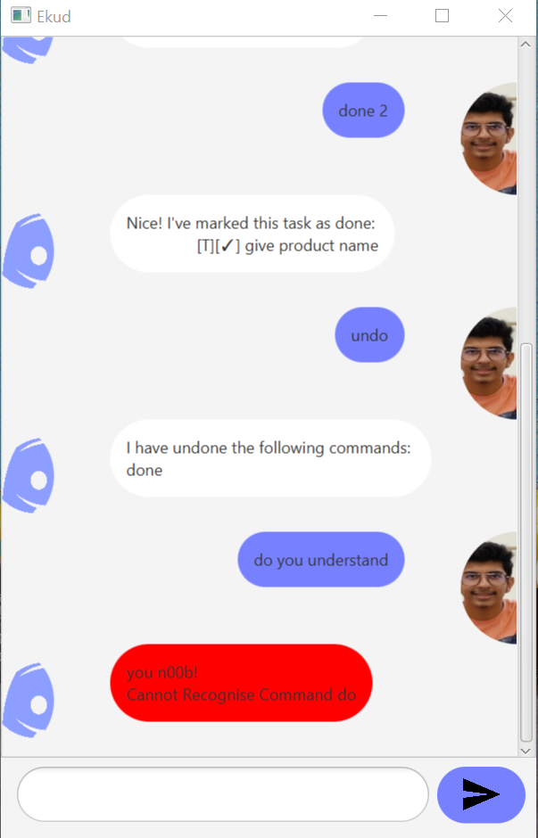

# User Guide for Ekud
*Ekud* is a task management application to keep track of your todos, deadlines and events. 
The task list is stored permanently in the hard disk and can be retrieved later.

## Index
* table of contents
{:toc}
## Features 

### Add
Users can add tasks such as Todos, Deadlines and Events into the tasklist.
### View
Users can view all the tasks stored in the tasklist.
### Done
Users can mark tasks as completed,
### Delete
Users can permanently delete a task from the tasklist.
### Search
Users can search for a particular task given a task description.
### Undo
Users can undo commands that were given in haste.

## Usage

### `todo` - Adding a todo
Adds a todo task into the tasklist with a given todo description

Usage: `todo <description>`

Example: `todo homework for CS2103T`

### `deadline` - Adding a deadline
Adds a deadline task into the tasklist with a given deadline description and by when the deadline is due.

Usage: `deadline <description> /by <date>`

**Note:** Date must be supplied in `YYYY-MM-DD` format!

Example: `deadline lab for CS2103T /by 2020-10-15`

### `event` - Adding an event
Adds a event task into the tasklist with a given event description and when the event is.

Usage: `event <description> /at <date>`

**Note:** Date must be supplied in `YYYY-MM-DD` format!

Example: `event lecture for CS2103T /at 2020-10-20`

### `list` - Lists all tasks
Lists all the tasks currently in the tasklist.

Usage: `list`

### `find` - Search for a task
Searches the current tasklist for task matches with the given search keyword.

Usage: `find <description>`

Example: `find CS2103T`

### `find` - Search for a task
Searches the current tasklist for task matches with the given search keyword.

Usage: `find <description>`

Example: `find CS2103T`

### `done` - Marking a task as done
Marks a given task as done.

Usage: `done <task_index>`

**Note:** `task_index` must be valid. Valid indices are within the range of the tasklist. You can view the tasklist by using [list](https://adithyanarayan.github.io/ip/#list---lists-all-tasks).

Example: `done 2`

### `delete` - Deletes a tasklist
Deletes a task in the tasklist *forever*.

Usage: `delete <task_index>`

**Note:** `task_index` must be valid. Valid indices are within the range of the tasklist. You can view the tasklist by using [list](https://adithyanarayan.github.io/ip/#list---lists-all-taskst). Note that once a task is deleted, the only way to bring it back is by using the [undo](https://adithyanarayan.github.io/ip/#undo---undo-previous-commands) command. If a task is deleted and the application is closed, there is no way to recover the deleted task.

Example: `delete 2`

### `undo` - Undo previous commands
Undoes a given number of previous commands.

Usage: `undo <no_of_commands>`

**Note:** `no_of_commands` must be valid. Valid numbers are within the number of commands sent within the current window. Note that undo commands are not undoable.

Example: `undo 2`

### `bye` - Undo previous commands
Closes the program.

Usage: `bye`
